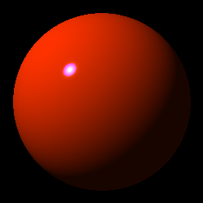

# Ray Tracer Renderer

This is my implementation for ray tracer renedering,
introduced on the book "The Ray Tracer Challenge" by Jamis Buck.
This is my first step in the world of computer graphics and renedering,
so this project will probably be revisted and rewritten at a later stage.


# Images



# Build
This repo includes 2 batch scripts to compile this project.
* __`shell.bat`__
* __`build.bat`__

## `shell.bat`
Helper script to setup all the required environment variables to be able to use the MSVC build tools.
This script uses `vswhere` tool to find the latest installed build tools, and opens a shell.

```shell
$ shell.bat

REM This should work after running shell.bat:
$ cl.exe
```

## `build.bat`
To use this script, the enviorment variables of the MSVC build tools should be set before calling this script.
You can do this either by calling first `shell.bat` or by activating yourself the `developer command prompt`.

__Note__: This code base was developed and tested with the build tools provided with __Visual Studio 2017__

```shell
$ build.bat
```
